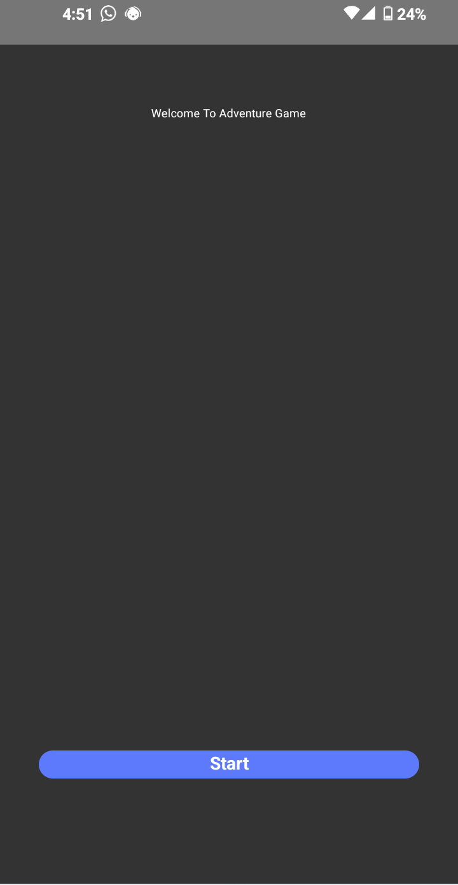
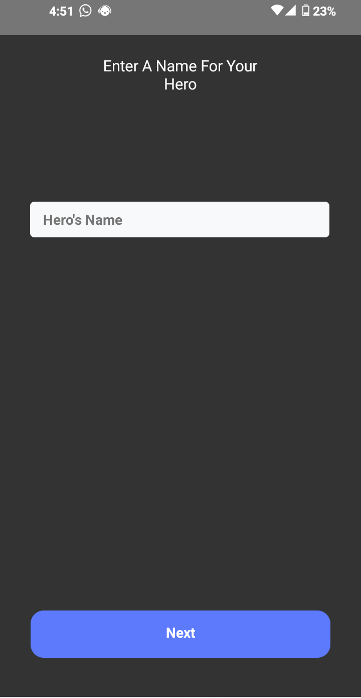
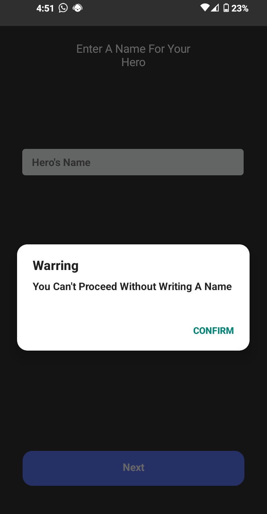
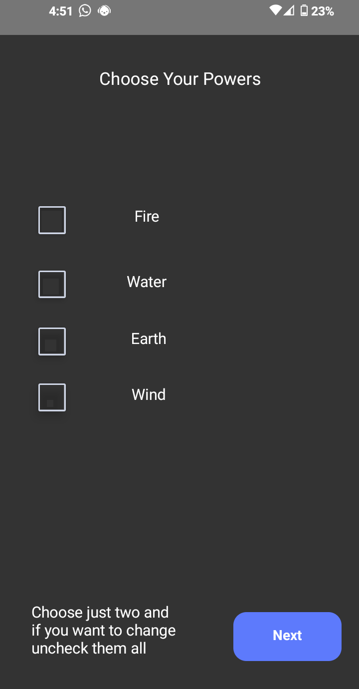
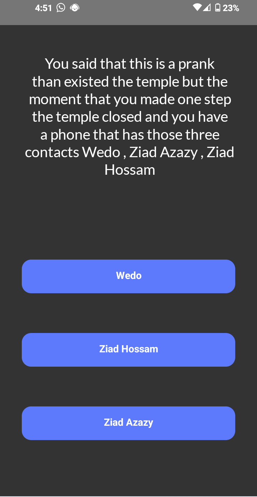
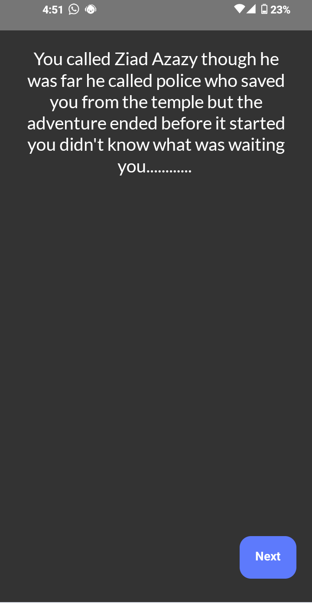
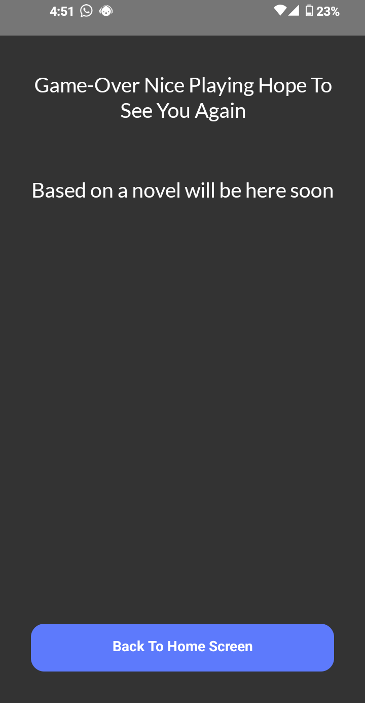
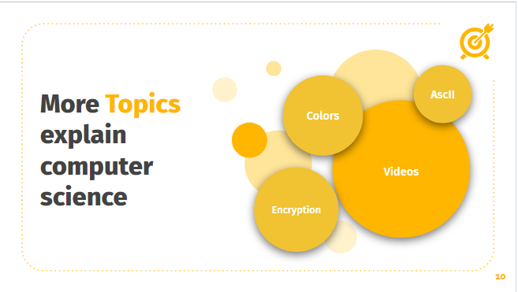
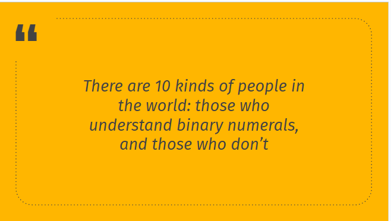

# DECI-L-1-Final-Project
This is my project for the final period of deci scholarship

This project has those files 
--
<ul>
  <li><a href="#App">App</a></li>
  <li><a href="#Website">Website</a></li>
  <li><a href="#Presntation">Presntation</a></li>
  <li><a href="#Doc">Doc File</a></li>
  <li><a href="#Cvs">Cvs File</a></li>
</ul>

<h2 id="App">App</h2>

Description

 
This app i made an adventure game that has many pros like 
  <ul>
   <li>Train those who can't take decision</li>
   <li>Fun to play on your free time</li>
   <li>Suitable  for all ages</li>
  </ul>

Screen Shots

 
 
 
 
 
 
 
 

Apk File

 
  <a href="App/Adventure-Game.apk">The App </a>
   
  <a href="https://x.thunkable.com/copy/8f52e6f80a2b56fcac72e368e74f06d0">The Code</a>

<h3 id="Website">Website</h3>

Description

 
This was my dream from being a kid i always wanted to make a portfilo website for me and i took the oprtunity from this project and with some research and learing css and more depth html i made my own portfilo and now with all these experince i want to be a front-end developer

Website Pros

 
There are so many pros i will mintion some
  <ul>
   <li>Present my work for all</li>
   <li>Made Contact with me easier</li>
   <li>Made me on the internt(casue the next step is to make google or any CEO know me:)</li>
  </ul>

Screen Shots

 

<h4 id="Presntation">Presntation</h4>

Description

 
this is a presntation about hard computer fundamentals i managed to explain it and i learned a lot from this presntation about how to present something and a lot of presntation skills

The Presentation

 
<a href="https://docs.google.com/presentation/d/1n2LBlwMlVYKpr931mGWhPZdJI_v7dCqmhFa7iHaJ1ik/edit?usp=sharing">Presentation-google-slides</a>
  <a href="presentation.pptx">Presentation-real-file</a>

Screen Shots

 
  

<h5 id="Doc">Doc File</h5>

Description

 
  

    In this document, I will delve into the specifications and features of my dream MacBook Pro, a laptop that combines sleek design, impressive performance, and seamless user experience. I will provide detailed descriptions of each component, explaining their roles and highlighting their significance in creating an exceptional computing device. Join me on this exploration of my dream MacBook Pro and discover the reasons behind my choices.
  

Doc file

 
 <a href="https://docs.google.com/document/d/1Uk-6Ev0J9BmlDx58GHIQR7M6FTH0BkbL3IaHxLZCYT8/edit?usp=sharing">Doc File-google-docs</a>
   <a href="My-dream-pc.docx">Doc File-real-file</a>

